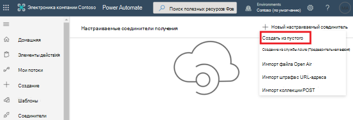
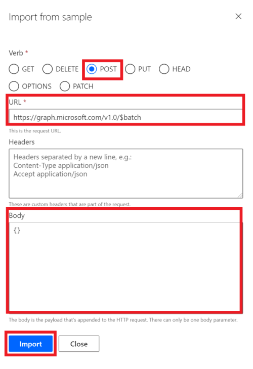

<!-- markdownlint-disable MD002 MD041 -->

В этом упражнении вы создадите новый настраиваемый соединитель, который можно использовать в Microsoft Power автоматизиру или в логических приложениях Azure.In this exercise, you will create a new custom connector which can be used in Microsoft Power Automate or in Azure Logic Apps. В файле определения Опенапи предварительно создается правильный путь к `$batch` конечной точке Microsoft Graph и дополнительные параметры для включения простого импорта.The OpenAPI definition file is prebuilt with the correct path for the Microsoft Graph `$batch` endpoint and additional settings to enable simple import.

Существует два способа создания настраиваемого соединителя для Microsoft Graph:There are two options to create a custom connector for Microsoft Graph:

- Создать из пустогоCreate from blank
- Импорт файла ОпенапиImport an OpenAPI file

## Вариант 1: Создание настраиваемого соединителя из пустого шаблонаOption 1: Create custom connector from blank template

Откройте браузер и перейдите в раздел [Автоматизация управления питанием (Майкрософт](https://flow.microsoft.com)).Open a browser and navigate to [Microsoft Power Automate](https://flow.microsoft.com). Войдите с помощью учетной записи администратора клиента Office 365.Sign in with your Office 365 tenant administrator account. Выберите **данные** в левой части меню, а затем выберите элемент **настраиваемые соединители** в раскрывающемся меню.Choose **Data** on the left-hand side menu, and select the **Custom Connectors** item in the drop-down menu.

На странице " **настраиваемые соединители** " выберите ссылку **создать настраиваемый соединитель** в правом верхнем углу, а затем в раскрывающемся меню выберите **создать из пустого** элемента.On the **Custom Connectors** page choose the **New custom connector** link in the top right, then select the **Create from blank** item in the drop-down menu.

Введите `MS Graph Batch Connector` в текстовом поле **имя соединителя** .Enter `MS Graph Batch Connector` in the **Connector name** text box. Choose **Continue**.Choose **Continue**.

На странице Настройка соединителя ( **Общие** ) заполните поля, как показано ниже.On the connector configuration **General** page, fill in the fields as follows.

- **Схема**: HTTPS**Scheme**: HTTPS
- **Узел**: `graph.microsoft.com`**Host**: `graph.microsoft.com`
- **Базовый URL-адрес**: `/`**Base URL**: `/`

Нажмите кнопку **Безопасность** , чтобы продолжить.Choose **Security** button to continue.

На странице **Безопасность** заполните поля, как показано ниже.On the **Security** page, fill in the fields as follows.

- **Выберите, какую проверку подлинности реализует ваш API**: `OAuth 2.0`**Choose what authentication is implemented by your API**: `OAuth 2.0`
- **Поставщик удостоверений**: `Azure Active Directory`**Identity Provider**: `Azure Active Directory`
- **Идентификатор клиента**: идентификатор приложения, созданный в предыдущем упражнении**Client id**: the application ID you created in the previous exercise
- **Секрет клиента**: ключ, созданный в предыдущем упражнении**Client secret**: the key you created in the previous exercise
- **URL-адрес входа**: `https://login.windows.net`**Login url**: `https://login.windows.net`
- **Идентификатор клиента**: `common`**Tenant ID**: `common`
- **URL-адрес ресурса**: `https://graph.microsoft.com` (без замыкающего/)**Resource URL**: `https://graph.microsoft.com` (no trailing /)
- **Область**: оставьте пустым**Scope**: Leave blank

Нажмите кнопку **определения** , чтобы продолжить.Choose **Definition** button to continue.

На странице **Определение** выберите **создать действие** и заполните поля, как показано ниже.On the **Definition** page, select **New Action** and fill in the fields as follows.

- **Сводка**: `Batch`**Summary**: `Batch`
- **Description**: `Execute Batch with Delegate Permission`**Description**: `Execute Batch with Delegate Permission`
- **Идентификатор операции**: `Batch`**Operation ID**: `Batch`
- **Видимость**: `important`**Visibility**: `important`

Создайте **запрос** , выбрав пункт **Импорт из примера** и заполните поля, как показано ниже.Create **Request** by selecting **Import from Sample** and fill in the fields as follows.

- **Команда**: `POST`**Verb**: `POST`
- **URL-адрес**: `https://graph.microsoft.com/v1.0/$batch`**URL**: `https://graph.microsoft.com/v1.0/$batch`
- **Заголовки**: оставьте пустым**Headers**: Leave blank
- **Основной текст**: `{}`**Body**: `{}`

Нажмите кнопку **Импорт**.Select **Import**.

Выберите **создать соединитель** в правом верхнем углу.Choose **Create Connector** on the top-right. После создания соединителя Скопируйте созданный **URL-адрес перенаправления** с страницы " **Безопасность** ".After the connector has been created, copy the generated **Redirect URL** from **Security** page.

Вернитесь к зарегистрированному приложению на [портале Azure](https://aad.portal.azure.com) , созданному в предыдущем упражнении.Go back to the registered application in the [Azure Portal](https://aad.portal.azure.com) you created in the previous exercise. Выберите пункт **Проверка подлинности** в левой части меню.Select **Authentication** on the left-hand side menu. Нажмите кнопку **Добавить платформу**, а затем выберите пункт **веб**.Select **Add a platform**, then select **Web**. Введите URL-адрес перенаправления, скопированный на предыдущем шаге в **URI перенаправления**, а затем нажмите кнопку **настроить**.Enter the redirect URL copied from the previous step in the **Redirect URIs**, then select **Configure**.

## Вариант 2: Создание настраиваемого соединителя путем импорта файла ОпенапиOption 2: Create custom connector by importing OpenAPI file

С помощью текстового редактора создайте новый пустой файл с именем `MSGraph-Delegate-Batch.swagger.json` и добавьте приведенный ниже код.Using a text editor, create a new empty file named `MSGraph-Delegate-Batch.swagger.json` and add the following code.

[!code-json]

Откройте браузер и перейдите в раздел [Автоматизация управления питанием (Майкрософт](https://flow.microsoft.com)).Open a browser and navigate to [Microsoft Power Automate](https://flow.microsoft.com). Войдите с помощью учетной записи администратора клиента Office 365.Sign in with your Office 365 tenant administrator account. Выберите **данные** в левой части меню, а затем выберите элемент **настраиваемые соединители** в раскрывающемся меню.Choose **Data** on the left-hand side menu, and select the **Custom Connectors** item in the drop-down menu.

На странице " **настраиваемые соединители** " выберите ссылку **создать настраиваемый соединитель** в правом верхнем углу, а затем в раскрывающемся меню выберите пункт **импортировать файл опенапи** .On the **Custom Connectors** page choose the **New custom connector** link in the top right, then select the **Import an OpenAPI file** item in the drop-down menu.

Введите `MS Graph Batch Connector` в текстовом поле **имя соединителя** .Enter `MS Graph Batch Connector` in the **Connector name** text box. Щелкните значок папки, чтобы отправить файл Опенапи.Choose the folder icon to upload the OpenAPI file. Перейдите к `MSGraph-Delegate-Batch.swagger.json` созданному файлу.Browse to the `MSGraph-Delegate-Batch.swagger.json` file you created. Нажмите **продолжить** , чтобы отправить файл опенапи.Choose **Continue** to upload the OpenAPI file.

На странице Конфигурация соединителя выберите ссылку **Безопасность** в меню Навигация.On the connector configuration page, choose the **Security** link in the navigation menu. Заполните поля, как показано ниже.Fill in the fields as follows.

- **Выберите, какую проверку подлинности реализует ваш API**: `OAuth 2.0`**Choose what authentication is implemented by your API**: `OAuth 2.0`
- **Поставщик удостоверений**: `Azure Active Directory`**Identity Provider**: `Azure Active Directory`
- **Идентификатор клиента**: идентификатор приложения, созданный в предыдущем упражнении**Client id**: the application ID you created in the previous exercise
- **Секрет клиента**: ключ, созданный в предыдущем упражнении**Client secret**: the key you created in the previous exercise
- **URL-адрес входа**: `https://login.windows.net`**Login url**: `https://login.windows.net`
- **Идентификатор клиента**: `common`**Tenant ID**: `common`
- **URL-адрес ресурса**: `https://graph.microsoft.com` (без замыкающего/)**Resource URL**: `https://graph.microsoft.com` (no trailing /)
- **Область**: оставьте пустым**Scope**: Leave blank

Выберите **создать соединитель** в правом верхнем углу.Choose **Create Connector** on the top-right. После создания соединителя Скопируйте созданный **URL-адрес перенаправления**.After the connector has been created, copy the generated **Redirect URL**.

Вернитесь к зарегистрированному приложению на [портале Azure](https://aad.portal.azure.com) , созданному в предыдущем упражнении.Go back to the registered application in the [Azure Portal](https://aad.portal.azure.com) you created in the previous exercise. Выберите пункт **Проверка подлинности** в левой части меню.Select **Authentication** on the left-hand side menu. Нажмите кнопку **Добавить платформу**, а затем выберите пункт **веб**.Select **Add a platform**, then select **Web**. Введите URL-адрес перенаправления, скопированный на предыдущем шаге в **URI перенаправления**, а затем нажмите кнопку **настроить**.Enter the redirect URL copied from the previous step in the **Redirect URIs**, then select **Configure**.

