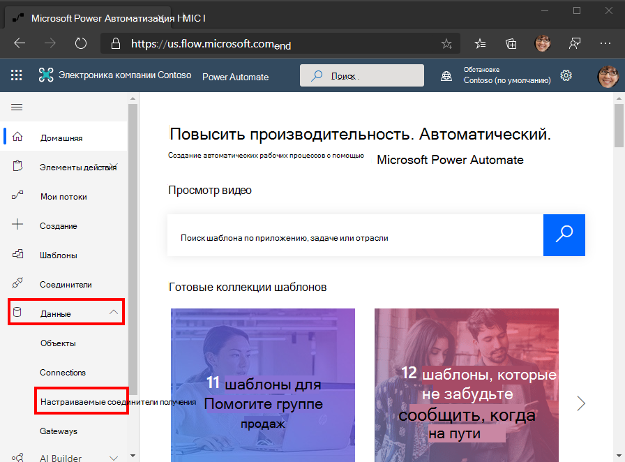
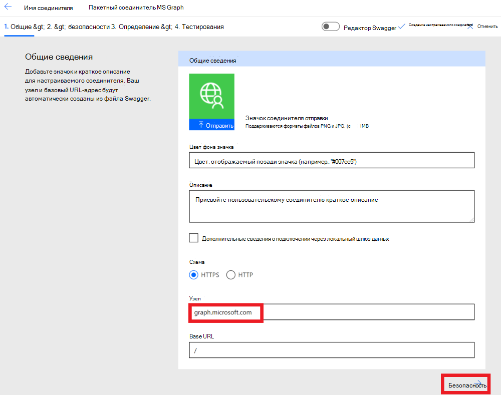
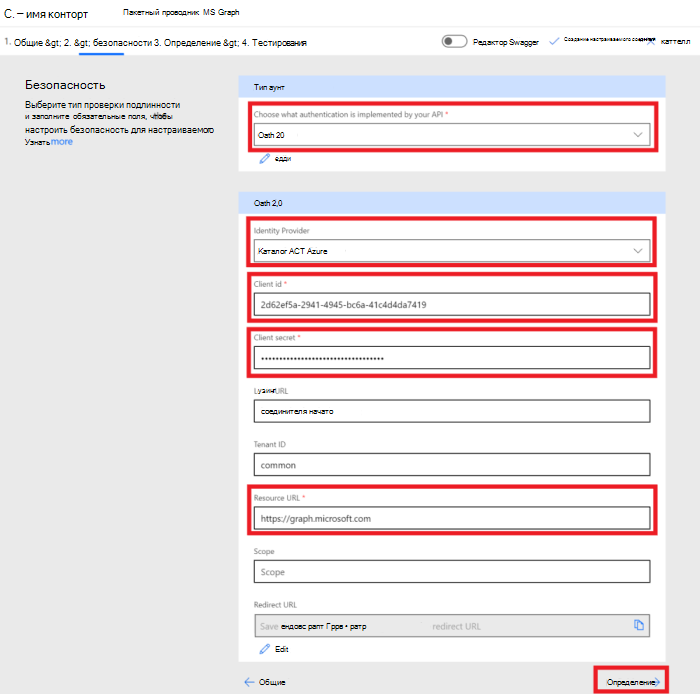

<!-- markdownlint-disable MD002 MD041 -->

В этом упражнении вы создадите новый настраиваемый соединитель, который можно использовать в Microsoft Power автоматизиру или в логических приложениях Azure. В файле определения Опенапи предварительно создается правильный путь к `$batch` конечной точке Microsoft Graph и дополнительные параметры для включения простого импорта.

Существует два способа создания настраиваемого соединителя для Microsoft Graph:

- Создать из пустого
- Импорт файла Опенапи

## Вариант 1: Создание настраиваемого соединителя из пустого шаблона

Откройте браузер и перейдите в раздел [Автоматизация управления питанием (Майкрософт](https://flow.microsoft.com)). Войдите с помощью учетной записи администратора клиента Office 365. Выберите **данные** в левой части меню, а затем выберите элемент **настраиваемые соединители** в раскрывающемся меню.

На странице " **настраиваемые соединители** " выберите ссылку **создать настраиваемый соединитель** в правом верхнем углу, а затем в раскрывающемся меню выберите **создать из пустого** элемента.

Введите `MS Graph Batch Connector` в текстовом поле **имя соединителя** . Choose **Continue**.

На странице Настройка соединителя ( **Общие** ) заполните поля, как показано ниже.

- **Схема**: HTTPS
- **Узел**: `graph.microsoft.com`
- **Базовый URL-адрес**: `/`

Нажмите кнопку **Безопасность** , чтобы продолжить.

На странице **Безопасность** заполните поля, как показано ниже.

- **Выберите, какую проверку подлинности реализует ваш API**: `OAuth 2.0`
- **Поставщик удостоверений**: `Azure Active Directory`
- **Идентификатор клиента**: идентификатор приложения, созданный в предыдущем упражнении
- **Секрет клиента**: ключ, созданный в предыдущем упражнении
- **URL-адрес входа**: `https://login.windows.net`
- **Идентификатор клиента**: `common`
- **URL-адрес ресурса**: `https://graph.microsoft.com` (без замыкающего/)
- **Область**: оставьте пустым

Нажмите кнопку **определения** , чтобы продолжить.

На странице **Определение** выберите **создать действие** и заполните поля, как показано ниже.

- **Сводка**: `Batch`
- **Description**: `Execute Batch with Delegate Permission`
- **Идентификатор операции**: `Batch`
- **Видимость**: `important`

Создайте **запрос** , выбрав пункт **Импорт из примера** и заполните поля, как показано ниже.

- **Команда**: `POST`
- **URL-адрес**: `https://graph.microsoft.com/v1.0/$batch`
- **Заголовки**: оставьте пустым
- **Основной текст**: `{}`

Нажмите кнопку **Импорт**.

Выберите **создать соединитель** в правом верхнем углу. После создания соединителя Скопируйте созданный **URL-адрес перенаправления** с страницы " **Безопасность** ".

Вернитесь к зарегистрированному приложению на [портале Azure](https://aad.portal.azure.com) , созданному в предыдущем упражнении. Выберите пункт **Проверка подлинности** в левой части меню. Нажмите кнопку **Добавить платформу**, а затем выберите пункт **веб**. Введите URL-адрес перенаправления, скопированный на предыдущем шаге в **URI перенаправления**, а затем нажмите кнопку **настроить**.

## Вариант 2: Создание настраиваемого соединителя путем импорта файла Опенапи

С помощью текстового редактора создайте новый пустой файл с именем `MSGraph-Delegate-Batch.swagger.json` и добавьте приведенный ниже код.

[!code-json]

Откройте браузер и перейдите в раздел [Автоматизация управления питанием (Майкрософт](https://flow.microsoft.com)). Войдите с помощью учетной записи администратора клиента Office 365. Выберите **данные** в левой части меню, а затем выберите элемент **настраиваемые соединители** в раскрывающемся меню.

На странице " **настраиваемые соединители** " выберите ссылку **создать настраиваемый соединитель** в правом верхнем углу, а затем в раскрывающемся меню выберите пункт **импортировать файл опенапи** .

Введите `MS Graph Batch Connector` в текстовом поле **имя соединителя** . Щелкните значок папки, чтобы отправить файл Опенапи. Перейдите к `MSGraph-Delegate-Batch.swagger.json` созданному файлу. Нажмите **продолжить** , чтобы отправить файл опенапи.

На странице Конфигурация соединителя выберите ссылку **Безопасность** в меню Навигация. Заполните поля, как показано ниже.

- **Выберите, какую проверку подлинности реализует ваш API**: `OAuth 2.0`
- **Поставщик удостоверений**: `Azure Active Directory`
- **Идентификатор клиента**: идентификатор приложения, созданный в предыдущем упражнении
- **Секрет клиента**: ключ, созданный в предыдущем упражнении
- **URL-адрес входа**: `https://login.windows.net`
- **Идентификатор клиента**: `common`
- **URL-адрес ресурса**: `https://graph.microsoft.com` (без замыкающего/)
- **Область**: оставьте пустым

Выберите **создать соединитель** в правом верхнем углу. После создания соединителя Скопируйте созданный **URL-адрес перенаправления**.

Вернитесь к зарегистрированному приложению на [портале Azure](https://aad.portal.azure.com) , созданному в предыдущем упражнении. Выберите пункт **Проверка подлинности** в левой части меню. Нажмите кнопку **Добавить платформу**, а затем выберите пункт **веб**. Введите URL-адрес перенаправления, скопированный на предыдущем шаге в **URI перенаправления**, а затем нажмите кнопку **настроить**.

