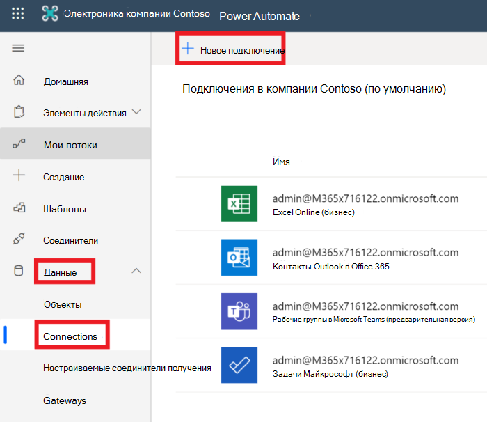
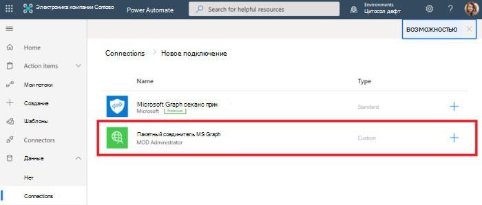
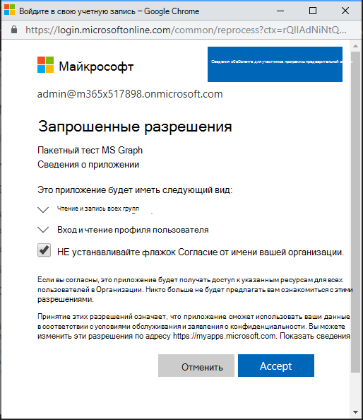

<!-- markdownlint-disable MD002 MD041 -->

Последняя настройка, позволяющая убедиться, что соединитель готов к использованию, — авторизация и тестирование настраиваемого соединителя для создания кэшированного подключения.

> [!IMPORTANT]
> Для выполнения описанных ниже действий необходимо войти в систему с правами администратора.

В [Microsoft Power Автоматизация](https://flow.microsoft.com)перейдите к пункту меню **данные** слева и выберите страницу **подключения** . Выберите ссылку **создать подключение** .

Найдите свой настраиваемый соединитель и завершите подключение, нажав кнопку со знаком "плюс". Войдите с помощью учетной записи Azure Active Directory администратора клиента Office 365.

При получении запроса на получение запрошенных разрешений проверяйте **согласие от имени вашей организации** , а затем нажмите кнопку **принять** для авторизации разрешений.

После авторизации разрешений подключение будет создано в Power Автоматизация.

Настраиваемый соединитель теперь настроен и включен. Возможна задержка, связанная с применением и доступностью разрешений, но соединитель настроен.
