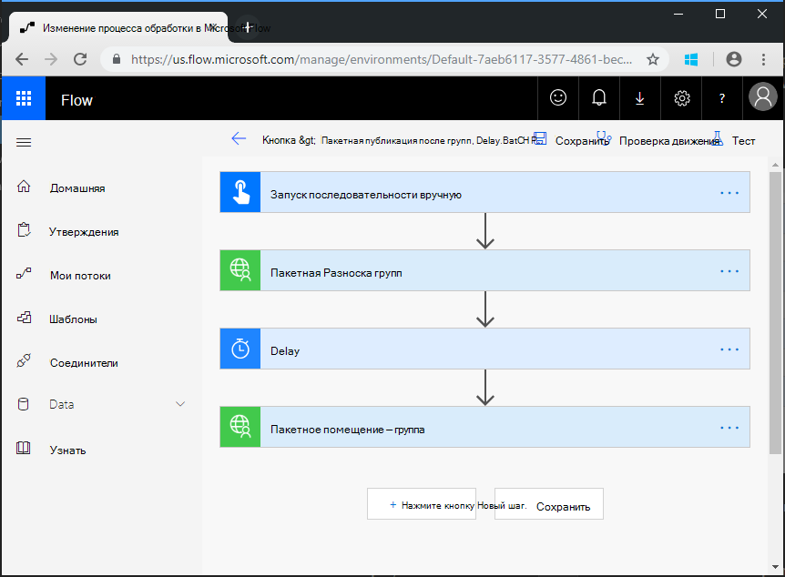
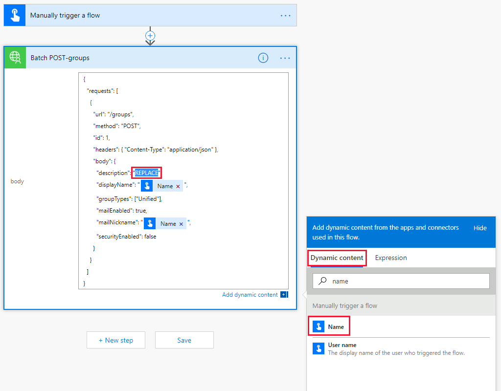
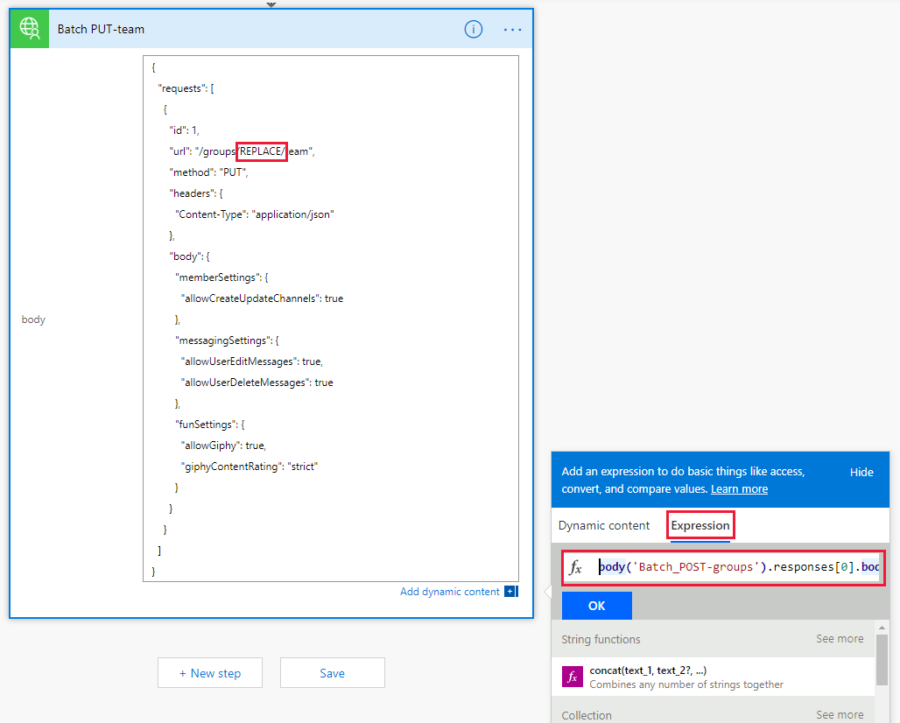
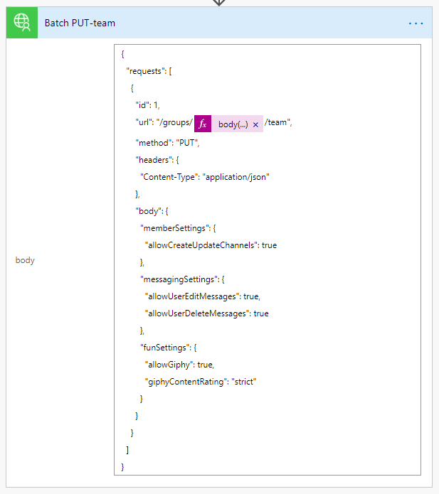
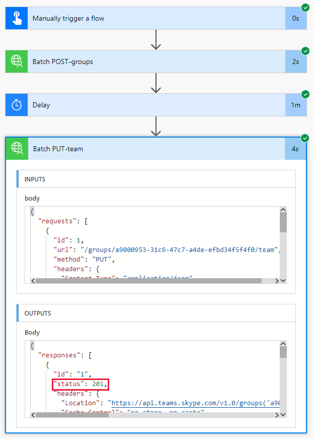

<!-- markdownlint-disable MD002 MD041 -->

В этом упражнении вы создадите последовательность для использования настраиваемого соединителя, созданного в предыдущих упражнениях, для создания и настройки группы Майкрософт. Этот процесс использует настраиваемый соединитель для отправки запроса POST на создание единой группы Office 365, приостанавливается на задержку при завершении создания группы, а затем отправляет запрос PUT для связи группы с командой Майкрософт.

В конце ваш процесс будет выглядеть примерно так, как показано на следующем рисунке:



Откройте [Microsoft Power автоматизирует](https://flow.microsoft.com) в браузере и войдите в систему с помощью учетной записи администратора клиента Office 365. Выберите пункт **мои потоки** в левой панели навигации. Выберите **создать**, а затем — **с пустым**. Введите `Create Team` для параметра **имя процесса**, а затем выберите **Запуск процесса вручную** в разделе **выберите способ активации этого процесса**. Нажмите кнопку **Создать**.

Выберите **ручной запуск элемента Flow** , а затем нажмите кнопку **Добавить вход**, выберите **текст** и введите `Name` название.


Выберите **новый шаг** и введите `Batch` в поле поиска. Добавьте действие **пакетного соединителя MS Graph** . Нажмите кнопку с многоточием и переименуйте это действие в `Batch POST-groups` .

Добавьте следующий код в поле **основного** текста действия.

```json
{
  "requests": [
    {
      "url": "/groups",
      "method": "POST",
      "id": 1,
      "headers": { "Content-Type": "application/json" },
      "body": {
        "description": "REPLACE",
        "displayName": "REPLACE",
        "groupTypes": ["Unified"],
        "mailEnabled": true,
        "mailNickname": "REPLACE",
        "securityEnabled": false
      }
    }
  ]
}
```

Замените каждый `REPLACE` заполнитель, выбрав `Name` значение из триггера вручную в меню **Добавление динамического содержимого** .



Выберите **новый шаг**, поиск `delay` и Добавление действия **задержки** и настройка в течение 1 минуты.

Выберите **новый шаг** и введите `Batch` в поле поиска. Добавьте действие **пакетного соединителя MS Graph** . Нажмите кнопку с многоточием и переименуйте это действие в `Batch PUT-team` .

Добавьте следующий код в поле **основного** текста действия.

```json
{
  "requests": [
    {
      "id": 1,
      "url": "/groups/REPLACE/team",
      "method": "PUT",
      "headers": {
        "Content-Type": "application/json"
      },
      "body": {
        "memberSettings": {
          "allowCreateUpdateChannels": true
        },
        "messagingSettings": {
          "allowUserEditMessages": true,
          "allowUserDeleteMessages": true
        },
        "funSettings": {
          "allowGiphy": true,
          "giphyContentRating": "strict"
        }
      }
    }
  ]
}
```

Выберите `REPLACE` заполнитель, а затем выберите **выражение** в области динамический контент. Добавьте в **выражение**следующую формулу.

```js
body('Batch_POST-groups').responses[0].body.id
```



Эта формула указывает, что мы хотим использовать идентификатор группы из результата первого действия.



Нажмите кнопку **сохранить**, а затем выберите пункт **тест** для выполнения последовательности.

> [!TIP]
> Если возникнет ошибка `The template validation failed: 'The action(s) 'Batch_POST-groups' referenced by 'inputs' in action 'Batch_2' are not defined in the template'` , выражение является неверным и, скорее всего, ссылается на действие, которое не удается найти. Убедитесь, что имя действия, на которое вы ссылаетесь, соответствует точно.

Выберите переключатель **я выполню действие триггера** и нажмите кнопку **сохранить & тест**. Нажмите кнопку **продолжить** в диалоговом окне. Введите имя без пробелов и выберите команду **выполнить поток** для создания команды.


Наконец, нажмите кнопку **Готово** , чтобы просмотреть журнал действий. По завершении процесса вы настроили группу и команду Office 365. Выберите элементы пакетного действия, чтобы просмотреть результаты пакетных вызовов JSON. `outputs` `Batch PUT-team` Действие должно иметь код состояния 201 для успешного сопоставления команды, как показано на рисунке ниже.


