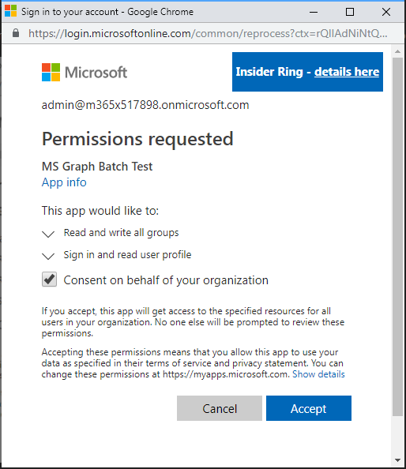

<!-- markdownlint-disable MD002 MD041 -->

Последняя настройка, позволяющая убедиться, что соединитель готов к использованию, — авторизация и тестирование настраиваемого соединителя для создания кэшированного подключения.The final configuration step to ensure the connector is ready for use is to authorize and test the custom connector to create a cached connection.

> [!IMPORTANT]
> Для выполнения описанных ниже действий необходимо войти в систему с правами администратора.The following steps requires that you are logged in with administrator privileges.

В [Microsoft Flow](https://flow.microsoft.com)перейдите к экрану конфигурация соединителя и выберите ссылку **проверить** в меню Навигация.In [Microsoft Flow](https://flow.microsoft.com), go to the Connector configuration screen and choose the **Test** link in the navigation menu. Выберите ссылку **создать подключение** .Choose the **New Connection** link. Войдите с помощью учетной записи Azure Active Directory администратора клиента Office 365.Sign in with your Office 365 tenant administrator's Azure Active Directory account.

При получении запроса на получение запрошенных разрешений проверяйте **согласие от имени вашей организации** , а затем нажмите кнопку **принять** для авторизации разрешений.When prompted for the requested permissions, check **Consent on behalf of your organization** and then choose **Accept** to authorize permissions.

После авторизации разрешений будет создано подключение.After you authorize the permissions, a connection is created in Flow.

Настраиваемый соединитель теперь настроен и включен.The custom connector is now configured and enabled. Возможна задержка, связанная с применением и доступностью разрешений, но соединитель настроен.There may be a delay in permissions being applied and available, but the connector is now configured.
