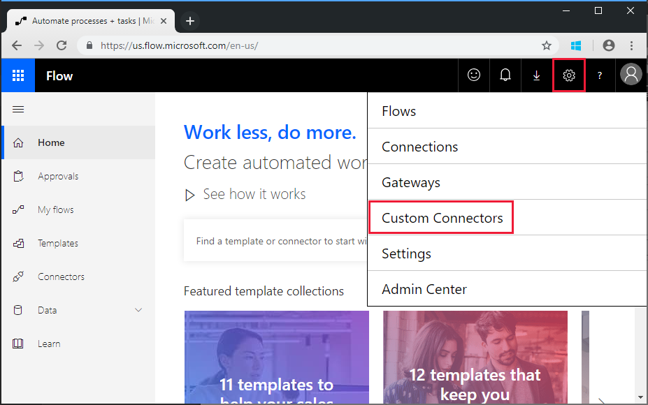
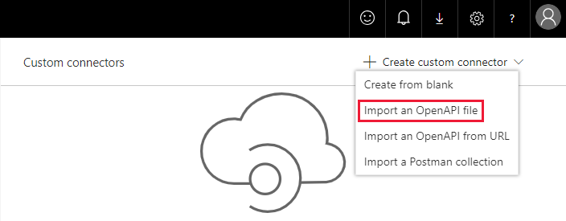

<!-- markdownlint-disable MD002 MD041 -->

В этом упражнении вы создадите новый настраиваемый соединитель, который можно использовать в последовательности или в приложениях логики Azure. В файле определения Open API предварительно создается правильный путь к конечной точке Microsoft Graph `$batch` и дополнительные параметры для включения простого импорта.

С помощью текстового редактора создайте новый пустой файл с именем `MSGraph-Delegate-Batch.swagger.json` и добавьте приведенный ниже код.

[!code-json]

Откройте браузер и перейдите в [Microsoft Flow](https://flow.microsoft.com). Войдите с помощью учетной записи администратора клиента Office 365. Щелкните значок шестеренки в правом верхнем углу и выберите элемент **настраиваемые соединители** в раскрывающемся меню.

На странице " **настраиваемые соединители** " выберите ссылку **создать настраиваемый соединитель** в правом верхнем углу, а затем в раскрывающемся меню выберите пункт **импортировать файл открытого API** .

 

Введите `MS Graph Batch Connector` в текстовое поле **имя настраиваемого соединителя** . Нажмите значок папки, чтобы отправить файл Open API. Перейдите к созданному `MSGraph-Delegate-Batch.swagger.json` файлу. Нажмите **продолжить** , чтобы отправить файл Open API.

 

На странице Конфигурация соединителя выберите ссылку **Безопасность** в меню Навигация. Заполните поля, как показано ниже.

- **Выберите, какую проверку подлинности реализует ваш API**:`OAuth 2.0`
- **Поставщик удостоверений**:`Azure Active Directory`
- **Идентификатор клиента**: идентификатор приложения, созданный в предыдущем упражнении
- **Секрет клиента**: ключ, созданный в предыдущем упражнении
- **URL-адрес входа**:`https://login.windows.net`
- **Идентификатор клиента**:`common`
- **URL-адрес ресурса**: `https://graph.microsoft.com` (без замыкающего/)
- **Область**: оставьте пустым

Нажмите кнопку **создать соединитель** в правом верхнем углу.

После создания соединителя Скопируйте созданный **URL-адрес перенаправления**.

Вернитесь к зарегистрированному приложению на портале [Azure](https://aad.portal.azure.com) , созданному в предыдущем упражнении. Выберите **URL-адреса ответа** в колонке **Параметры** . Добавьте **URL-адрес перенаправления** , скопированный в качестве дополнительного **URL-адреса ответа**. Сохраните приложение на портале Azure Active Directory.

