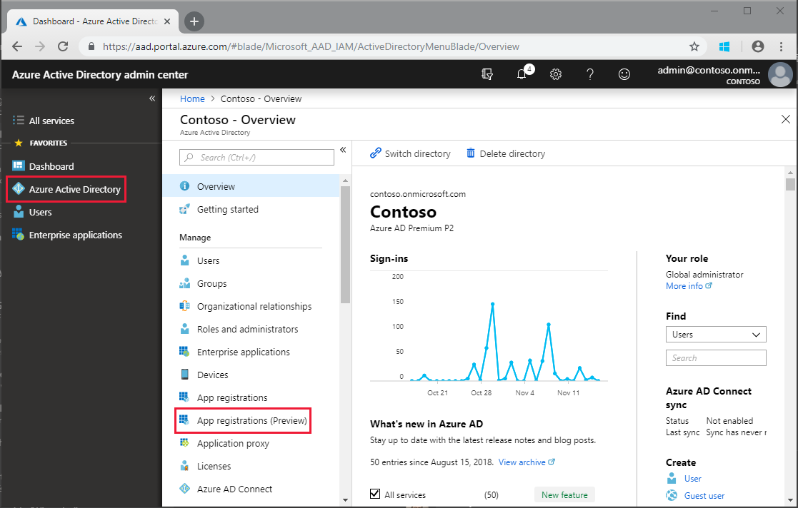
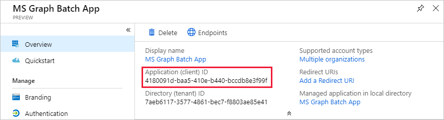
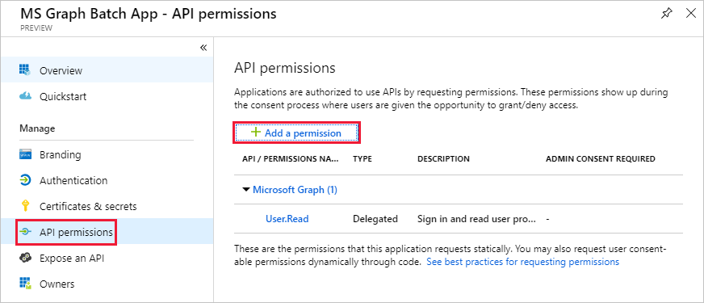

<!-- markdownlint-disable MD002 MD041 -->

В этом упражнении вы создадите новое приложение Azure Active Directory, которое будет использоваться для предоставления делегированных разрешений для настраиваемого соединителя.In this exercise, you will create a new Azure Active Directory Application which will be used to provide the delegated permissions for the custom connector.

Откройте браузер и перейдите в [центр администрирования Azure Active Directory](https://aad.portal.azure.com).Open a browser and navigate to [Azure Active Directory admin center](https://aad.portal.azure.com). Выберите ссылку **Azure Active Directory** в левом меню навигации, а затем выберите запись **регистрации приложений** в разделе **Управление** в колонке **Azure Active Directory** .Choose the **Azure Active Directory** link in the left navigation menu, then choose the **App registrations** entry in the **Manage** section of the **Azure Active Directory** blade.

Выберите новый элемент меню **Регистрация** в верхней части колонки **Регистрация приложений** .Choose the **New registration** menu item at the top of the **App Registrations** blade.

Введите `MS Graph Batch App` в поле **имя** .Enter `MS Graph Batch App` in the **Name** field. В разделе **Поддерживаемые типы учетных записей** выберите **учетные записи в любом организационном каталоге**.In the **Supported account types** section, select **Accounts in any organizational directory**. Оставьте незаполненным раздел **URI перенаправления** и выберите **регистр**.Leave the **Redirect URI** section blank and choose **Register**.

В колонке **Пакетное приложение MS Graph** скопируйте **идентификатор Application (Client)**.On the **MS Graph Batch App** blade, copy the **Application (client) ID**. Это потребуется в следующем упражнении.You'll need this in the next exercise.

Выберите элемент **разрешения API** в разделе **Управление** в колонке **пакетного приложения MS Graph** .Choose the **API permissions** entry in the **Manage** section of the **MS Graph Batch App** blade. Выберите **Добавить разрешение** в разделе **разрешения для API**.Choose **Add a permission** under **API permissions**.

В колонке **запрос API разрешений** выберите **Microsoft Graph**, а затем — **делегированные разрешения**.In the **Request API permissions** blade, choose the **Microsoft Graph**, then choose **Delegated permissions**. Выполните поиск `group`, а затем выберите разрешение **чтение и запись всех групп** , делегированные разрешения.Search for `group`, then select the **Read and write all groups** delegated permission. В нижней части блейд-сайта выберите **Добавить разрешения** .Choose **Add permissions** at the bottom of the blade.

 

Выберите " **Сертификаты и секреты** " в разделе **Управление** в колонке **пакетного приложения MS Graph** , а затем выберите **новый секрет клиента**.Choose the **Certificates and secrets** entry in the **Manage** section of the **MS Graph Batch App** blade, then choose **New client secret**. Введите `forever` в поле **Описание** и выберите пункт **никогда** в разделе **срок действия**.Enter `forever` in the **Description** and select **Never** under **Expires**. Нажмите кнопку **Добавить**.Choose **Add**.

Скопируйте значение ключа для нового ключа.Copy the key value for the new key. Это потребуется в следующем упражнении.You'll need this in the next exercise.

> [!IMPORTANT]
> Этот шаг очень важен, так как при закрытии этой колонки ключ будет недоступен.This step is critical as the key will not be accessible once you close this blade. Сохраните этот ключ в текстовом редакторе, чтобы использовать его в предстоящих упражнениях.Save this key to a text editor for use in upcoming exercises.

Чтобы включить управление дополнительными службами через Microsoft Graph, в том числе свойства Teams, необходимо выбрать дополнительные, соответствующие области, чтобы разрешить управление определенными службами.To enable management of additional services accessible via the Microsoft Graph, including Teams properties, you would need to select additional, appropriate scopes to enable managing specific services. Например, чтобы расширить решение для создания записных книжек OneNote или планов планировщика, сегментов и задач, необходимо добавить необходимые области разрешений для соответствующих API.For example, to extend our solution to enable creating OneNote Notebooks or Planner plans, buckets and tasks you would need to add the required permission scopes for the relevant APIs.
