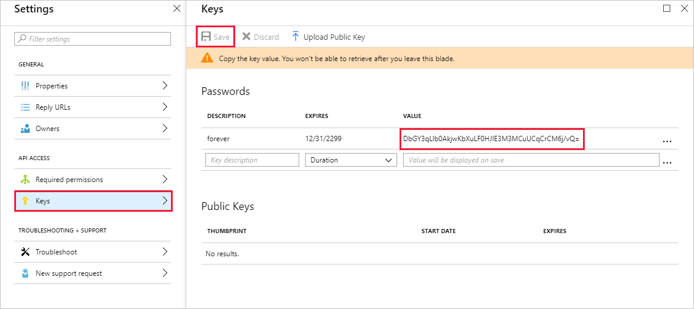

<!-- markdownlint-disable MD002 MD041 -->

В этом упражнении вы создадите новое приложение Azure Active Directory, которое будет использоваться для предоставления делегированных разрешений для настраиваемого соединителя.In this exercise, you will create a new Azure Active Directory Application which will be used to provide the delegated permissions for the custom connector.

Откройте браузер и перейдите в [центр администрирования Azure Active Directory](https://aad.portal.azure.com).Open a browser and navigate to [Azure Active Directory admin center](https://aad.portal.azure.com). Выберите ссылку **Azure Active Directory** в левом меню навигации, а затем выберите запись **регистрации приложений** в разделе **Управление** в колонке **Azure Active Directory** .Choose the **Azure Active Directory** link in the left navigation menu, then choose the **App registrations** entry in the **Manage** section of the **Azure Active Directory** blade.

Выберите новый элемент меню **Регистрация приложения** в верхней части колонки **Регистрация приложений** .Choose the **New application registration** menu item at the top of the **App Registrations** blade.

Введите `MS Graph Batch App` в поле **имя** , а `https://localhost.com/$batch` в поле **URL-адрес входа** нажмите кнопку **создать**.Enter `MS Graph Batch App` in the **Name** field, and `https://localhost.com/$batch` in the **Sign-on URL** field and choose **Create**.

На странице **Пакетное приложение MS Graph** скопируйте **идентификатор** приложения.On the **MS Graph Batch App** page, copy the **Application ID** of the application. Это потребуется в следующем упражнении.You'll need this in the next exercise.

Выберите **Параметры** в разделе Имя приложения, а затем выберите элемент меню **необходимые разрешения** в колонке параметры.Choose the **Settings** gear under the application name, then choose the **Required Permissions** menu item in the Settings blade. В верхней части **обязательных разрешений** нажмите кнопку **Добавить** .Choose **Add** at the top of the **Required Permissions** blade.

В колонке **Добавить API Access** выберите параметр **выбрать API** , а затем выберите элемент **Microsoft Graph** и нажмите **кнопку Выбрать** в нижней части колонки.Choose the **Select an API** option in the **Add API access** blade, then select the **Microsoft Graph** item and choose **Select** at the bottom of the blade.

В колонке **включить доступ** прокрутите окно вниз до раздела **делегированные разрешения** .On the **Enable Access** blade, scroll down to the **Delegated Permissions** section. Выберите разрешения на **чтение и запись всех групп** , а затем нажмите кнопку **выбрать** в нижней части колонки.Select the **Read and write all groups** delegated permission, then choose **Select** at the bottom of the blade. Нажмите кнопку **done (Готово** ) в нижней части колонки **Add API Access** .Choose **Done** at the bottom of the **Add API access** blade.

 

Выберите пункт меню **клавиши** в колонке **Параметры** .Choose the **Keys** menu item on the **Settings** blade. Введите `forever` в поле **ключевое описание** и выберите **срок действия не ограничен** в раскрывающемся меню **Длительность** .Enter `forever` in the **Key description** and select **Never expires** from the **Duration** drop down menu. Нажмите кнопку **сохранить** в верхней части колонки " **ключи** ".Choose **Save** at the top of the **Keys** blade. Скопируйте значение ключа для нового ключа.Copy the key value for the new key. Это потребуется в следующем упражнении.You'll need this in the next exercise.

> [!IMPORTANT]
> Этот шаг очень важен, так как при закрытии этой колонки ключ будет недоступен.This step is critical as the key will not be accessible once you close this blade. Сохраните этот ключ в текстовом редакторе, чтобы использовать его в предстоящих упражнениях.Save this key to a text editor for use in upcoming exercises.

Чтобы включить управление дополнительными службами через Microsoft Graph, в том числе свойства Teams, необходимо выбрать дополнительные, соответствующие области, чтобы разрешить управление определенными службами.To enable management of additional services accessible via the Microsoft Graph, including Teams properties, you would need to select additional, appropriate scopes to enable managing specific services. Например, чтобы расширить решение для создания записных книжек OneNote или планов планировщика, сегментов и задач, необходимо добавить необходимые области разрешений для соответствующих API.For example, to extend our solution to enable creating OneNote Notebooks or Planner plans, buckets and tasks you would need to add the required permission scopes for the relevant APIs.
