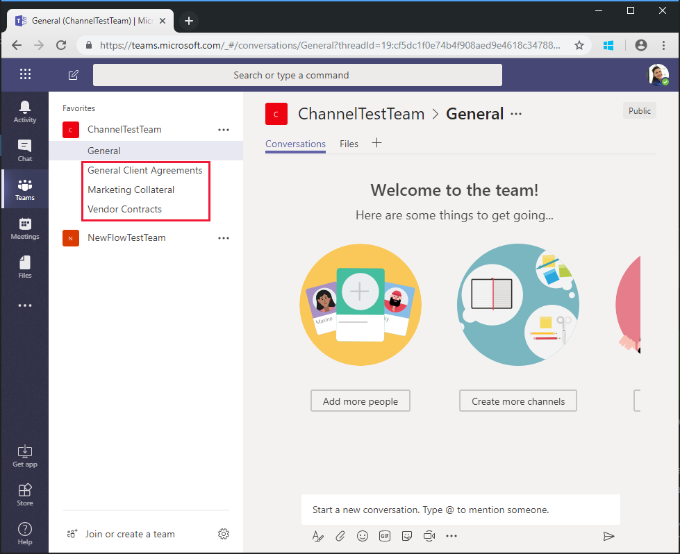

<!-- markdownlint-disable MD002 MD041 -->

<span data-ttu-id="a4af5-101">В примере, созданном в предыдущем упражнении, `$batch` используется API для создания двух отдельных запросов к Microsoft Graph.</span><span class="sxs-lookup"><span data-stu-id="a4af5-101">The Flow you created in the previous exercise uses the `$batch` API to make two individual requests to the Microsoft Graph.</span></span> <span data-ttu-id="a4af5-102">Такой способ `$batch` вызова конечной точки предоставляет некоторые преимущества и гибкость, но при использовании нескольких запросов к `$batch` Microsoft Graph в едином `$batch` вызове возступает его работа.</span><span class="sxs-lookup"><span data-stu-id="a4af5-102">Calling the `$batch` endpoint this way provides some benefit and flexibility, but the true power of the `$batch` endpoint comes when executing multiple requests to Microsoft Graph in a single `$batch` call.</span></span> <span data-ttu-id="a4af5-103">В этом упражнении вы узнаете, как создать единую группу и связать группу с созданием нескольких каналов по умолчанию для группы в едином `$batch` запросе.</span><span class="sxs-lookup"><span data-stu-id="a4af5-103">In this exercise, you will extend the example of creating a Unified Group and associating a Team to include creating multiple default Channels for the Team in a single `$batch` request.</span></span>

<span data-ttu-id="a4af5-104">Откройте [Microsoft Flow](https://flow.microsoft.com) в браузере и войдите с помощью учетной записи администратора клиента Office 365.</span><span class="sxs-lookup"><span data-stu-id="a4af5-104">Open [Microsoft Flow](https://flow.microsoft.com) in your browser and sign in with your Office 365 tenant administrator account.</span></span> <span data-ttu-id="a4af5-105">Выберите процесс, созданный на предыдущем шаге, и нажмите кнопку **изменить**.</span><span class="sxs-lookup"><span data-stu-id="a4af5-105">Select the Flow you created in the previous step and choose **Edit**.</span></span>

<span data-ttu-id="a4af5-106">Выберите **новый шаг** и введите `Batch` в поле поиска.</span><span class="sxs-lookup"><span data-stu-id="a4af5-106">Choose **New step** and type `Batch` in the search box.</span></span> <span data-ttu-id="a4af5-107">Добавьте действие **пакетНого соединителя MS Graph** .</span><span class="sxs-lookup"><span data-stu-id="a4af5-107">Add the **MS Graph Batch Connector** action.</span></span> <span data-ttu-id="a4af5-108">Нажмите кнопку с многоточием и переименуйте это `Batch POST-channels`действие в.</span><span class="sxs-lookup"><span data-stu-id="a4af5-108">Choose the ellipsis and rename this action to `Batch POST-channels`.</span></span>

<span data-ttu-id="a4af5-109">Добавьте следующий код в поле **основного** текста действия.</span><span class="sxs-lookup"><span data-stu-id="a4af5-109">Add the following code into the **body** text box of the action.</span></span>

```json
{
  "requests": [
    {
      "id": 1,
      "url": "/teams/REPLACE/channels",
      "headers": {
        "Content-Type": "application/json"
      },
      "method": "POST",
      "body": {
        "displayName": "Marketing Collateral",
        "description": "Marketing collateral and documentation."
      }
    },
    {
      "id": 2,
      "dependsOn": [
        "1"
      ],
      "url": "/teams/REPLACE/channels",
      "headers": {
        "Content-Type": "application/json"
      },
      "method": "POST",
      "body": {
        "displayName": "Vendor Contracts",
        "description": "Vendor documents, contracts, agreements and schedules."
      }
    },
    {
      "id": 3,
      "dependsOn": [
        "2"
      ],
      "url": "/teams/REPLACE/channels",
      "headers": {
        "Content-Type": "application/json"
      },
      "method": "POST",
      "body": {
        "displayName": "General Client Agreements",
        "description": "General Client documents and agreements."
      }
    }
  ]
}
```

<span data-ttu-id="a4af5-110">Обратите внимание, что в трех запросах выше используется свойство [dependsOn](https://docs.microsoft.com/graph/json-batching#sequencing-requests-with-the-dependson-property) для указания порядка следования, и каждый из них ВЫПОЛНЯЕТ запрос POST для создания нового канала в новой команде.</span><span class="sxs-lookup"><span data-stu-id="a4af5-110">Notice the three requests above are using the [dependsOn](https://docs.microsoft.com/graph/json-batching#sequencing-requests-with-the-dependson-property) property to specify a sequence order, and each will execute a POST request to create a new channel in the new Team.</span></span>

<span data-ttu-id="a4af5-111">Выберите каждый экземпляр `REPLACE` заполнителя, а затем в области динамический контент выберите **выражение** .</span><span class="sxs-lookup"><span data-stu-id="a4af5-111">Select each instance of the `REPLACE` placeholder, then select **Expression** in the dynamic content pane.</span></span> <span data-ttu-id="a4af5-112">Добавьте в **выражение**следующую формулу.</span><span class="sxs-lookup"><span data-stu-id="a4af5-112">Add the following formula into the **Expression**.</span></span>

```js
body('Batch_PUT-team').responses[0].body.id
```


<span data-ttu-id="a4af5-114">Нажмите кнопку **сохранить**, а затем выберите пункт **тест** для выполнения последовательности.</span><span class="sxs-lookup"><span data-stu-id="a4af5-114">Choose **Save**, then choose **Test** to execute the Flow.</span></span> <span data-ttu-id="a4af5-115">Установите переключатель \*\*\*\* действие триггера, а затем нажмите кнопку **сохранить тест _амп_**.</span><span class="sxs-lookup"><span data-stu-id="a4af5-115">Select the **I'll perform the trigger** action radio button, then choose **Save & Test**.</span></span> <span data-ttu-id="a4af5-116">В поле **имя** введите уникальное имя группы без пробелов и нажмите кнопку **выполнить поток** для выполнения потока.</span><span class="sxs-lookup"><span data-stu-id="a4af5-116">Enter a unique group name in the **Name** field without spaces, and choose **Run flow** to execute the Flow.</span></span>


<span data-ttu-id="a4af5-118">После запуска потока нажмите кнопку Просмотреть ссылку **действия по выполнению потока** , а затем выберите запущенный поток, чтобы просмотреть журнал действий.</span><span class="sxs-lookup"><span data-stu-id="a4af5-118">Once the Flow starts, choose the **See flow run activity** link, then choose the running Flow to see the activity log.</span></span>

<span data-ttu-id="a4af5-119">По завершении потока итоговые выходные данные для `Batch POST-channels` действия будут иметь ответ о состоянии HTTP 201 для каждого созданного канала.</span><span class="sxs-lookup"><span data-stu-id="a4af5-119">When the Flow completes, the final output for the `Batch POST-channels` action has a 201 HTTP Status response for each Channel created.</span></span>


<span data-ttu-id="a4af5-121">Перейдите в [Microsoft Teams](https://teams.microsoft.com) и войдите с помощью учетной записи администратора клиента Office 365.</span><span class="sxs-lookup"><span data-stu-id="a4af5-121">Browse to [Microsoft Teams](https://teams.microsoft.com) and sign in with your Office 365 tenant administrator account.</span></span> <span data-ttu-id="a4af5-122">Убедитесь, что отображается только что созданная команда и включает три канала, созданные `$batch` запросом.</span><span class="sxs-lookup"><span data-stu-id="a4af5-122">Verify that the team you just created appears and includes the three channels created by the `$batch` request.</span></span>



<span data-ttu-id="a4af5-124">Хотя вышеприведенное `Batch POST-channels` действие было реализовано в этом руководстве как отдельное действие, вызовы для создания каналов могли быть добавлены в качестве дополнительных вызовов в `Batch PUT-team` действии.</span><span class="sxs-lookup"><span data-stu-id="a4af5-124">While the above `Batch POST-channels` action was implemented in this tutorial as a separate action, the calls to create the channels could have been added as additional calls in the `Batch PUT-team` action.</span></span> <span data-ttu-id="a4af5-125">Это приведет к созданию команды и всем каналам в едином пакетном звонке.</span><span class="sxs-lookup"><span data-stu-id="a4af5-125">This would have created the Team and all Channels in a single batch call.</span></span> <span data-ttu-id="a4af5-126">Попытайтесь сделать это самостоятельно.</span><span class="sxs-lookup"><span data-stu-id="a4af5-126">Give that a try on your own.</span></span>

<span data-ttu-id="a4af5-127">Наконец, обратите внимание, что вызовы [пакетНой обработки JSON](https://docs.microsoft.com/graph/json-batching) будут возвращать код состояния HTTP для каждого запроса.</span><span class="sxs-lookup"><span data-stu-id="a4af5-127">Finally, remember that [JSON Batching](https://docs.microsoft.com/graph/json-batching) calls will return an HTTP status code for each request.</span></span> <span data-ttu-id="a4af5-128">В рабочем процессе может потребоваться объединить обработку результатов с [`Apply to each`](https://docs.microsoft.com/flow/apply-to-each) действием и проверить, имеет ли каждый отдельный ответ код состояния 201, или компенсировать любые другие коды состояния.</span><span class="sxs-lookup"><span data-stu-id="a4af5-128">In a production process, you may want to combine post processing of the results with an [`Apply to each`](https://docs.microsoft.com/flow/apply-to-each) action and validate each individual response has a 201 status code or compensate for any other status codes received.</span></span>